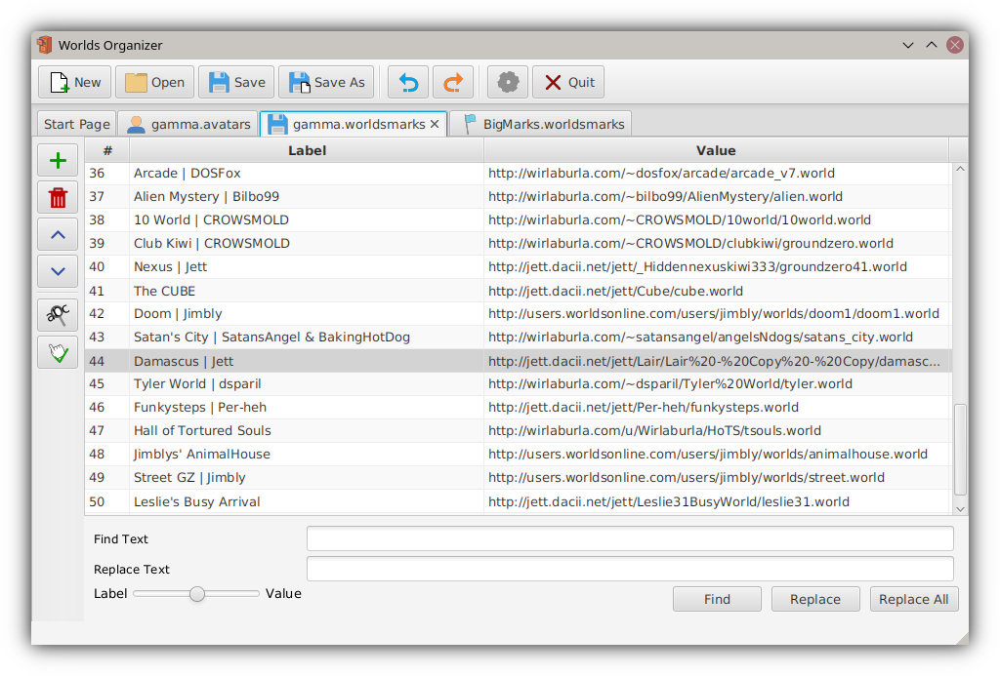

# Worlds Organizer
[]()

A tool for WorldsPlayer files and resources to edit, modify, and organize your lists and data.

The tool is planned to support all these features:
 - [x] Editing WorldsMarks files
 - [x] Editing Avatar files
 - [ ] Editing Library files
 - [ ] Avatar Creator
 - [ ] World scanner
 - [ ] Avatar preview

## Compiling
Worlds Organizer uses maven, and is packaged using Shade. The minimum supported Java is 8 with support being aimed for later versions aswell.
Make sure you are using a JDK, and compile using maven.

1. Clone the repository and enter it's contents

```
git clone https://wirlaburla.com/git/Wirlaburla/Worlds-Organizer.git
cd Worlds-Organizer
```

2. Run the Maven Shade command

```
mvn clean package
```

The shaded jar will be located within the shade folder. It is runnable and contains the dependencies required.

## Using
Builds provided are in a JAR, which can be run using any version of Java 8 or above. These builds should be cross-platform and non-platform specific, so they should not require native OS libraries or calls.

Simply run the JAR with JRE 8 or up. Running from the command-line is simple using Java arguments:

```
java -jar WorldsOrganizer.jar
```

Upon startup, a start page should be shown as the first tab. This page will inform you of the current version, the current contributors, and the build date. Among these, there is also a changelog on the other side that is updated per release.

If you are running an older version and there is a newer release available, you'll be greeted by an update dialog. It is recommended to update considering that it's possible it has fixed a major bug or issue that may corrupt your files.

### Preferences
The tool allows changing a few preferences. In these settings are the options to toggle update checking and file backup attempts, as well as change the visual appearance of the program or 'theme'. These settings are saved within a config.json file neighboring the jar. It is recommended to have read/write access in the same folder as the jar.

### Editing Lists
The tool divides different types of files based on how their contents are saved. Avatars and WorldsMarks fall under a 'List' system, and therefore show in a normal table interface.

Controls for such lists are shown on the left-hand side. Among the normal Add, Delete, and Move buttons are the Find/Replace pane, and a Link checker.

Their uses are as follows:
 * Find/Replace - Find and replace instances of text in the table. A slider is visible within the pane that allows toggling which column to find or replace things in.
 * Link Checker - Scans the table for any web links and attempts to ping them to determine if the site is still active. This can be inaccurate at times but is a useful tool. A table in the end is displayed with the failed links. This feature takes network activity.

You can edit a value or label by double clicking on it's cell, and then changing the text inside. Hitting 'enter' will then confirm the contents in the cell and save.

## Information
Worlds Organizer is not affiliated with Worlds Incorporated or it's products.

To avoid loss of data or corruption, it is recommended to backup your files before directly modifying them.


